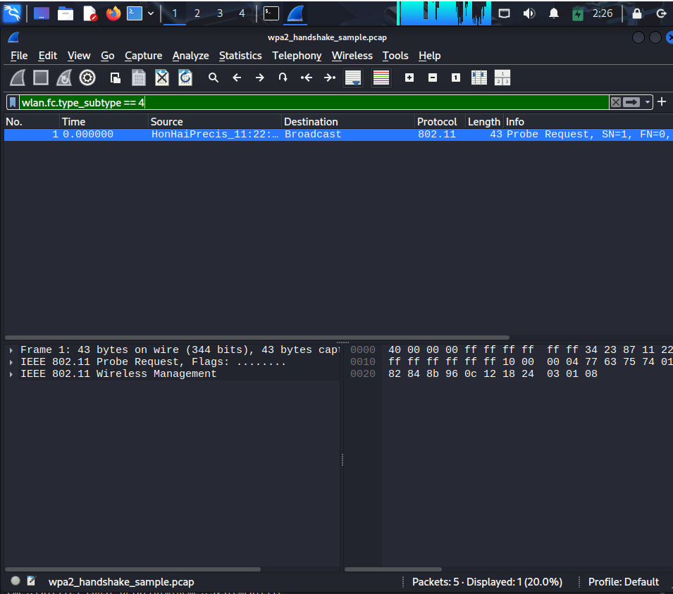
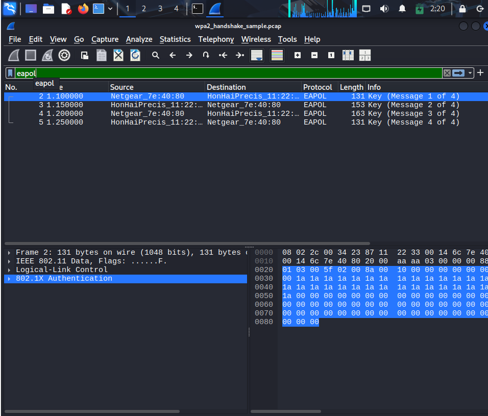

# 🛡️ Threat Intelligence & WPA2-Personal Security Analysis
### Threat Intelligence & Vulnerability Assessment on WPA2-Personal Networks: From 4-Way Handshake Capture to MitM Risk Mitigation

> **Mata Kuliah:** Cyber Threat Intelligence (CTI)  
> **Dosen Pengampu:** RUNAL REZKIAWAN, S.Kom., M.T.  
> **Disusun Oleh:** ALAMSYAH SAHLAN  
> **NIM:** 105841111823  
> **Link Video YouTube:** [Tempelkan Link Video YouTube Anda di Sini Nanti]  

---

## 📋 1. Deskripsi Proyek
Proyek ini menganalisis tingkat keamanan protokol **WPA2 Personal (PSK)** melalui teknik penangkapan paket data (*packet capture*) dan analisis *4-Way Handshake*. Proyek ini bertujuan memetakan potensi ancaman (*Threat Intelligence*) yang memanfaatkan kerentanan jaringan nirkabel serta memberikan rekomendasi mitigasinya berbasis kerangka kerja **MITRE ATT&CK**.

---

## 🛠️ 2. Alat dan Lingkungan Pengujian
- **OS Penyerang/Analisis:** Kali Linux & Windows Analyzer
- **Tools Utama:** Wireshark, Aircrack-ng Suite, Python PCAP Engine
- **Target Network:** SSID Uji Coba (`wcut`) - Channel 8
- **Protokol Terlibat:** IEEE 802.11, EAPOL (802.1X), DHCP, ARP

---

## 🔍 3. Hasil Analisis Traffic & Handshake

### A. Probe Request & Discovery
Penangkapan paket broadcast *Probe Request* dari perangkat klien untuk mendeteksi keberadaan SSID target (`wcut`) pada Channel 8. Metadata yang diisolasi meliputi Radio Header, SSID Name, dan Format Frame Heksadesimal/ASCII.



### B. WPA2 4-Way Handshake (EAPOL)
Proses pertukaran kunci berhasil direkam dan dianalisis secara mendalam:
- **Message 1/4 (AP ➡️ Client):** Pengiriman AP Nonce (**ANonce**) secara terbuka (plaintext).
- **Message 2/4 (Client ➡️ AP):** Pengiriman Client Nonce (**SNonce**) dan **MIC** (Message Integrity Code) untuk memvalidasi Pre-Shared Key (PSK).
- **Message 3/4 (AP ➡️ Client):** Konfirmasi pemasangan PTK dan pengiriman **GTK (Group Temporal Key)** terenkripsi.
- **Message 4/4 (Client ➡️ AP):** Konfirmasi akhir bahwa kedua belah pihak telah menginstal kunci dan sesi komunikasi terenkripsi (AES-CCMP) dimulai.



---

## ⚠️ 4. Threat Intelligence & Pemetaan Kerentanan

| Threat Vector | MITRE ATT&CK / CVE | Tingkat Risiko | Deskripsi Singkat & Dampak |
| :--- | :--- | :--- | :--- |
| **Network Sniffing** | **T1040** | 🟡 **Medium** | Penangkapan frame 802.11 di udara tanpa otentikasi. |
| **Offline Handshake Cracking** | **T1110.001** | 🔴 **High** | Ekstraksi PTK/PMK via dictionary attack terhadap capture handshake. |
| **Adversary-in-the-Middle** | **T1557.002** | 🟠 **Medium-High** | Pengalihan lalu lintas lokal via ARP Spoofing akibat tiadanya otentikasi ARP. |
| **KRACK Vulnerability** | **CVE-2017-13077** | 🔴 **High** | Memaksa instalasi ulang kunci nonce saat Message 3/4 untuk dekripsi data. |

---

## 🛡️ 5. Rekomendasi Mitigasi (Intelligence Action)
1. **Password Policy:** Gunakan Pre-Shared Key (PSK) minimal 16–20 karakter kombinasi Alfanumerik + Simbol untuk menggagalkan *offline dictionary attack*.
2. **Patch & Firmware Update:** Rutin memperbarui firmware AP dan sistem operasi klien untuk menutup celah kerentanan KRACK.
3. **Migrasi Protokol:** Mempertimbangkan migrasi ke **WPA3-Personal** yang menggunakan *Simultaneous Authentication of Equals (SAE)* untuk mencegah serangan *offline dictionary attack*.
4. **Implementasi Wireless IPS (WIPS):** Menggunakan sistem pemantauan untuk mendeteksi *Rogue AP*, *deauthentication flooding*, atau pemindaian mode monitor yang mencurigakan.

---

## 📁 6. Struktur Repositori
```text
├── captures/
│   └── wpa2_handshake_sample.pcap    # File Capture Handshake
├── screenshots/
│   ├── wireshark_eapol.png           # Bukti Analisis EAPOL 1-4
│   └── probe_request.png             # Bukti Probe Request Discovery
├── README.md                         # Dokumentasi Utama
└── references.md                     # Daftar Referensi Standar & CVE